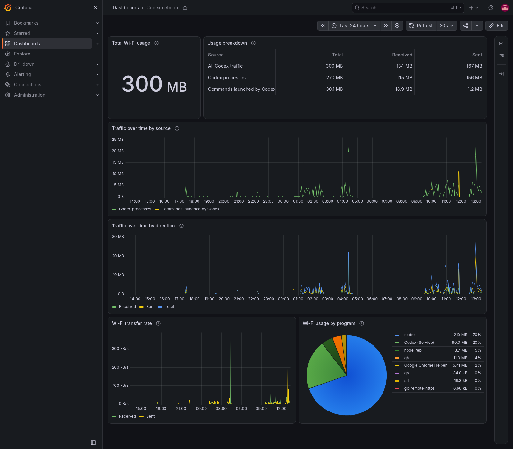

# codex-netmon

`codex-netmon` is a macOS command-line tool that measures Wi-Fi traffic attributed to Codex processes and commands launched by Codex. It exports OpenTelemetry metrics over OTLP/HTTP, so you can chart the traffic in Grafana or another OpenTelemetry-compatible system.



The screenshot shows real measurements from a local Grafana session; your values will differ.

## Requirements

- macOS with the built-in `nettop` and `ps` commands
- An OTLP/HTTP metrics receiver, such as OpenTelemetry Collector
- Go 1.26.5 to build from source; [mise](https://mise.jdx.dev/) manages the development toolchain
- Docker with Compose for the optional local Grafana stack

## Install

```sh
go install github.com/yudai2929/codex-netmon@latest
```

To install with mise and use the short name `codex-netmon`, run:

```sh
mise use -g go@1.26.5
mise tool-alias set codex-netmon go:github.com/yudai2929/codex-netmon
mise use -g codex-netmon
```

Alternatively, download the macOS arm64 or amd64 archive from [GitHub Releases](https://github.com/yudai2929/codex-netmon/releases). If the `go install` command is not on your `PATH`, add `$(go env GOBIN)` when it is set, or `$(go env GOPATH)/bin` otherwise. To build from a checkout instead:

```sh
mise install
mise run build
./dist/codex-netmon -help
```

## Run

Start your OTLP/HTTP receiver first, then run:

```sh
codex-netmon -endpoint http://127.0.0.1:4318/v1/metrics -interval 5s
```

The endpoint above is the default. `-interval` controls both sampling and metric export and defaults to `5s`. Stop the foreground process with Ctrl-C. The tool runs only on macOS and needs access to the operating system's process and network information. If macOS prompts for permissions, grant only those required by your setup.

To start the bundled local Grafana, Prometheus, and OTLP receiver with Docker Compose, add `-local-stack`:

```sh
codex-netmon -local-stack
```

The command prints the dashboard URL and OTLP endpoint, then starts monitoring in the foreground. The Grafana dashboard opens at `http://127.0.0.1:3000`; a fresh local stack uses `admin` / `admin`. The stack keeps running after Ctrl-C; the command to stop it is printed at startup. If the default ports are in use, choose free ones with `-grafana-port` and `-otlp-port`, for example `codex-netmon -local-stack -grafana-port 3001 -otlp-port 4319`. If you pass `-endpoint`, the monitor continues to send metrics to that endpoint.

For an optional per-user background service from a source checkout, run `mise run service-start`; use `mise run service-stop` to stop it. This LaunchAgent uses the default local endpoint and writes logs under `.run/` in the checkout.

## Metrics

| OTLP metric | Type | Unit | Meaning |
| --- | --- | --- | --- |
| `codex.wifi.received` | cumulative counter | bytes | Wi-Fi bytes received |
| `codex.wifi.sent` | cumulative counter | bytes | Wi-Fi bytes sent |

Each metric includes `process` (the executable name) and `process_kind` (`codex` or `command`). `codex` covers recognized Codex desktop, service, renderer, and CLI processes. `command` covers descendants launched by Codex command hosts. The metric resource has `service.name=codex-netmon`. Prometheus commonly exposes the counters as `codex_wifi_received_bytes_total` and `codex_wifi_sent_bytes_total`.

## Grafana dashboard

The optional [Codex netmon dashboard](grafana/dashboards/codex-netmon.json) shows total bytes, received and sent bytes by source, traffic over time, transfer rate, and usage by executable. The time picker controls the reporting range. The dashboard is generated in Go with the [Grafana Foundation SDK](dashboard/) and needs Grafana with a Prometheus data source named `prometheus`. The CLI itself only needs an OTLP/HTTP metrics receiver.

For a ready-to-run local Grafana and OTLP receiver from a source checkout:

```sh
mise install
mise run up
mise run build
./dist/codex-netmon
```

Open [Grafana at localhost:3000](http://127.0.0.1:3000) and find **Codex / Codex netmon**. For a fresh local stack, sign in with `admin` / `admin` and change the password when prompted. Keep the CLI running to collect traffic, and use Ctrl-C to stop it. Run `mise run down` to stop the local stack. This setup binds Grafana and the OTLP endpoint to localhost. If those ports are already in use, stop the conflicting local service first or adjust the port mappings and CLI endpoint.

To use an existing Grafana installation, import the dashboard JSON and select its `prometheus` data source, or provision it from [the included provider](grafana/provisioning/dashboards/provider.yaml). The dashboard generator runs with `mise run dashboard` and writes the JSON to `grafana/dashboards/codex-netmon.json`.

For a Grafana time series of traffic over the selected interval, use `sum(increase(codex_wifi_received_bytes_total[$__rate_interval]))` and the matching `sent` expression. For a total over the selected time range, use `sum(increase(codex_wifi_received_bytes_total[$__range])) + sum(increase(codex_wifi_sent_bytes_total[$__range]))`. Use `process_kind="command"` to isolate commands launched by Codex.

## How attribution works

At each sample, the tool reads macOS `nettop -t wifi` counters and a `ps` process tree. It matches known Codex executables and their command descendants, then exports byte deltas between samples. A newly observed process is counted from its first visible `nettop` value only if it was absent from the previous process tree.

This is an estimate of traffic associated with Codex processes, not a packet-level accounting or an OpenAI API usage meter. Very short-lived processes may finish between samples. Traffic shifted into a separate daemon, container, VPN interface, or another network interface may be absent. Other network activity by a matched process is included. Wi-Fi link overhead is not included. Measurements start when the tool starts; past traffic cannot be recovered.

## Development

```sh
mise install
mise run test
mise run lint
mise run fmt-check
mise run dashboard
mise run build
```

This project is licensed under the [MIT License](LICENSE).
